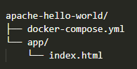
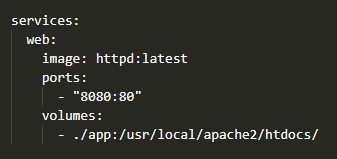

## Criando um Container de uma Aplicação WEB

Servidor Apache com Docker Compose
Este projeto cria um servidor Apache HTTP (httpd) usando um arquivo docker-compose.yml, servindo uma aplicação web simples (Hello World). A aplicação é disponibilizada via repositório no GitHub.

📁 Estrutura do Projeto

⚙️ Pré-requisitos

- Docker

- Docker Compose

- Conta no GitHub

🧱 Passo a Passo

1. Criar a aplicação

Crie uma pasta chamada app com um arquivo index.html dentro:

<!-- app/index.html -->
<!DOCTYPE html>
<html lang="pt-BR">
<head>
    <meta charset="UTF-8">
    <title>Hello World</title>
</head>
<body>
    <h1>Hello, World a partir do Apache via Docker!</h1>
</body>
</html>

2. Criar o arquivo docker-compose.yml

Crie o arquivo docker-compose.yml com o seguinte conteúdo:

version: '3'

Este arquivo define um contêiner usando a imagem oficial do Apache (httpd). Ele mapeia a porta 8080 do host para a porta 80 do contêiner e monta a pasta ./app como diretório raiz do Apache.

3. Executar o servidor Apache

No terminal, na raiz do projeto, execute:

docker-compose up

Abra o navegador e acesse:
http://localhost:8080

Você deverá ver a mensagem "Hello, World a partir do Apache via Docker!"

4. Subir para o GitHub
Crie um novo repositório no GitHub (sem README).

No terminal:

git init
git add .
git commit -m "Servidor Apache com Docker e Hello World"
git branch -M main
git remote add origin https://github.com/seu-usuario/seu-repositorio.git
git push -u origin main

Substitua seu-usuario e seu-repositorio pelos dados reais do seu GitHub.

✅ Resultado Esperado
A aplicação "Hello World" será servida por um contêiner Apache.

A aplicação estará disponível publicamente no GitHub.